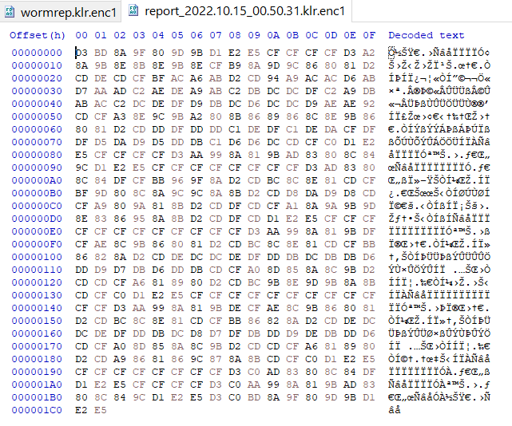

# Wormrep

## Description

I found something weird last night, but I can't open the [report](https://asisctf.com/tasks/wormrep_41c6f2494b3cf6ed0030b95ae19a98705aa593ff.txz)! Please help!!

## Approach

- We received a `.enc1` file, so I knew that is an `Encrypted file` so I try to find how to Decrypt that file.
- I am aware that before `.enc1`, there is an `.klr` so I searched it on Google and I bumped into [this](https://support.kaspersky.com/us/15675).
- The `wormrep.klr.enc1` file is a report files containing the results of scan tasks of [Kaspersky Virus Removal Tool](https://support.kaspersky.com/kvrt2020). I downloaded the tool I try to read the report file but I can't import the file to read it.
- So I try a different way. After scanning, `KVRT` create some report files in `C:\KVRT2020_Data\Report` folder. I replace data of one of the report files with the data of `wormrep.klr.enc1`. I did it with [HxD Editor](https://mh-nexus.de/en/hxd/)

- Just open `KVRT.exe` and read the data-replaced report. And we get the flag.

Flag : `ASIS{N07_@ll_v!ru535_@r3_AS_8@d_a5_cov!d}`