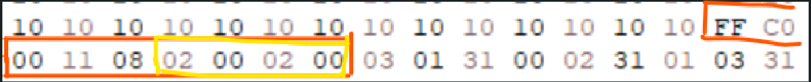
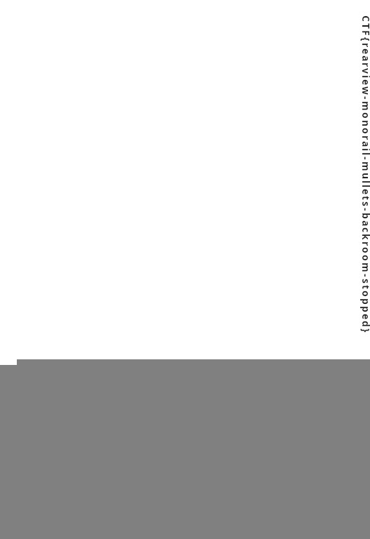
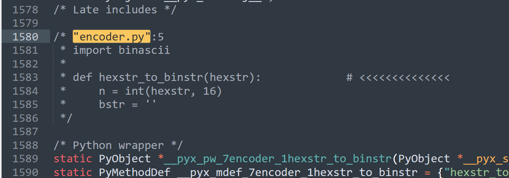

# GoogleCTF 2023 - Misc

I solved 3 Misc-challenges this year, more than before. Even though last year I only solved 1 of them 🐳. 

---
## PAPAPAPA
### Description

Is this image really just white?
[Attachment](https://storage.googleapis.com/gctf-2023-attachments-project/d2e5b38d584108c2b63150e7a073b8c104972ee59b83f5ee44d9ef6ae0118b4ad57e64cb328d7e8b839989ae741f793ded5fef7f51f7ecbbaaeaa716312f18c9.zip)

### Approach 

Challenge just give us an all-white JPG file. With experience many times for this kind of challenge, I started with change size of the file. Fortunately, it worked for this time.🐧
> You can change JPEG picture size by modifying data after `FF C0 00 11 08` bytes in hexformat of the file.


I saw something like ASCII character in this picture so I just keep changing size til I got the flag. It worked with 528x768


`Flag: CTF{rearview-monorail-mullets-backroom-stopped}`

---
## NPC
### Description

A friend handed me this map and told me that it will lead me to the flag. 
It is confusing me and I don't know how to read it, can you help me out?
[Attachment](https://storage.googleapis.com/gctf-2023-attachments-project/9a8f5d47fab0a460f9826c4f13aa1dff2809140e68325fb21edab674ee5ec2476b902d2797c41bd6d9311e3510c9366d739d9404e00aa9d4ffd6a0d88e5bf2ef.zip)

### Approach 
This challenge can be easily solved with [Trie](https://en.wikipedia.org/wiki/Trie) data-structure.
I use Trie to storage all words from given Dictionary and check if a character is following by a character. It helps me find the possible passwords.
```python
from collections import defaultdict
import re

class TrieNode:
    def __init__(self, char):
        self.char = char
        self.is_end = False
        self.children = {}


class Trie(object):

    def __init__(self):

        self.root = TrieNode("")

    def insert(self, word):

        node = self.root

        for char in word:
            if char in node.children:
                node = node.children[char]
            else:

                new_node = TrieNode(char)
                node.children[char] = new_node
                node = new_node

        node.is_end = True
    def has_next_char(self, node, char):
        for n in node.children:
            if (node.children[n].char == char):
                return node.children[n]

        return False


lines = open('hint.dot').readlines()
nodes = {}

adj = defaultdict(list)
trie = Trie()


def get_word_list():
    with open('USACONST.TXT', encoding='ISO8859') as f:
        text = f.read()
    return list(set(re.sub('[^a-z]', ' ', text.lower()).split()))


for word in get_word_list():
    trie.insert(word)

for line in lines:
    line = line.strip()
    if 'label=' in line:
        char = line.split('label=')[1].split(']')[0]
        id = int(line.split(' [label')[0])
        nodes[id] = [id, char]
    if '--' in line:
        a, b = map(int, line.replace(';', '').split(' -- '))
        adj[a].append(b)
        adj[b].append(a)


visit = {}


def solve(u, Node=trie.root, len=28):
    id, char = nodes[u]
    nextNode = trie.has_next_char(Node, char)

    res = []

    if not nextNode:
        if Node.is_end:
            return solve(u, trie.root, len)
        return []

    len -= 1

    visit[id] = True


    if len == 0:
        return [char]

    for v in adj[id]:
        if not v in visit:
            possible_chars = solve(v, nextNode, len)
            for p in possible_chars:
                res.append(char + p)

    del visit[id]

    return res


for startingNode in nodes.values():
    visit = {}
    for word in solve(startingNode[0], trie.root, 28):
        print(word)
```
Possible Passwords:
```
dwatersigngivenchosenstandar
givenstandardsignwaterchosen
signgivenstandardwaterchosen
waterchosenstandardsigngiven
standardwatersigngivenchosen
chosenstandardwatersigngiven
```
I try to decrypt the `secret` with all possible passwords.
```python
from pyrage import passphrase
filename = 'secret.age'
secret = ""
possible_pwd = ["dwatersigngivenchosenstandar",
"givenstandardsignwaterchosen",
"signgivenstandardwaterchosen",
"waterchosenstandardsigngiven",
"standardwatersigngivenchosen",
"chosenstandardwatersigngiven"]
with open(filename, 'rb') as f:
    secret = f.read()
    for pwd in possible_pwd:
        try:
            print(passphrase.decrypt(secret, pwd))
        except:
            pass
```
`Flag: CTF{S3vEn_bR1dg35_0f_K0eN1g5BeRg}`

---
## SYMATRIX

### Description

The CIA has been tracking a group of hackers who communicate using PNG files embedded with a custom steganography algorithm. 
An insider spy was able to obtain the encoder, but it is not the original code. 
You have been tasked with reversing the encoder file and creating a decoder as soon as possible in order to read the most recent PNG file they have sent.
[Attachment](https://storage.googleapis.com/gctf-2023-attachments-project/aba60aa2e9c806187f88279742c2ced243dd73b142c5c5bac1327956975e4d3add04afad77cfd823dd4f00847f6334b294ab058308639f8cb52897e8f1be769e.zip)

### Approach

This challenge give us a `.c` file generated by [Cython](http://docs.cython.org/en/latest/index.html) from a `.py` file. I recovered the python code line by line by from comment lines like this in `encoder.c`.


This is the original python code.

```python
from PIL import Image
from random import randint
import binascii
 
def hexstr_to_binstr(hexstr):
    n = int(hexstr, 16)
    bstr = ''
    while n > 0:
        bstr = str(n % 2) + bstr
        n = n >> 1
    if len(bstr) % 8 != 0:
        bstr = '0' + bstr
    return bstr


def pixel_bit(b):
    return tuple((0, 1, b))


def embed(t1, t2):
    return tuple((t1[0] + t2[0], t1[1] + t2[1], t1[2] + t2[2]))


def full_pixel(pixel):
    return pixel[1] == 255 or pixel[2] == 255

print("Embedding file...")

bin_data = open("./flag.txt", 'rb').read()      
data_to_hide = binascii.hexlify(bin_data).decode('utf-8')
 
base_image = Image.open("./original.png")
 
x_len, y_len = base_image.size
nx_len = x_len * 2
 
new_image = Image.new("RGB", (nx_len, y_len))

base_matrix = base_image.load()
new_matrix = new_image.load()

binary_string = hexstr_to_binstr(data_to_hide)
remaining_bits = len(binary_string)

nx_len = nx_len - 1
next_position = 0

for i in range(0, y_len):
    for j in range(0, x_len):

        pixel = new_matrix[j, i] = base_matrix[j, i]
 
        if remaining_bits > 0 and next_position <= 0 and not full_pixel(pixel):
            new_matrix[nx_len - j, i] = embed(pixel_bit(int(binary_string[0])),pixel)
            next_position = randint(1, 17)
            binary_string = binary_string[1:]
            remaining_bits -= 1
        else:
            new_matrix[nx_len - j, i] = pixel
            next_position -= 1
 
 
new_image.save("./symatrix.png")
new_image.close()
base_image.close()
print("Work done!")
exit(1)
```
Code Summary: The encoder create `symmatrix.png` by duplicating and flipping vertically the `original.png` then concatenating the `original.png` and the flipped one into a picture. The flag is hidden in the flipped side (right side) of the picture by random changing the third value of some pixels. Notice the following snippets
```python
if remaining_bits > 0 and next_position <= 0 and not full_pixel(pixel):
            new_matrix[nx_len - j, i] = embed(pixel_bit(int(binary_string[0])),pixel)
            next_position = randint(1, 17)
            binary_string = binary_string[1:]
            remaining_bits -= 1
```
Because the flag has been turn into a binary string so third value of each pixel been increased to one or zero. I compared the original and the flipped one to wrap all the changes into a binary string which is the flag by the following script.
```python
from PIL import Image
import binascii


def binstr_to_hexstr(binstr):
    hexstr = hex(int(binstr, 2))[2:]
    if len(hexstr) % 2 != 0:
        hexstr = '0' + hexstr
    return hexstr


from base64 import *


embed_image = Image.open("./symatrix.png")
embed_matrix = embed_image.load()
x_len, y_len = embed_image.size
bstr = ""
for i in range(y_len):
    for j in range(x_len//2):
        if(embed_matrix[j,i] != embed_matrix[x_len - 1 - j,i]):
            bstr += str(embed_matrix[x_len-1-j,i][2])
print(b16decode(binstr_to_hexstr(bstr).upper()))
```
`Flag: CTF{W4ke_Up_Ne0+Th1s_I5_Th3_Fl4g!}`

>Thank you so much for taking the time to read my write-ups. Feel free to comment and there's anything wrong.